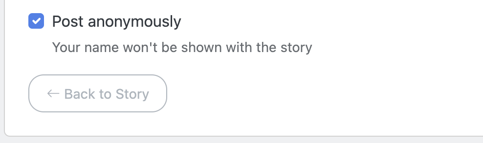
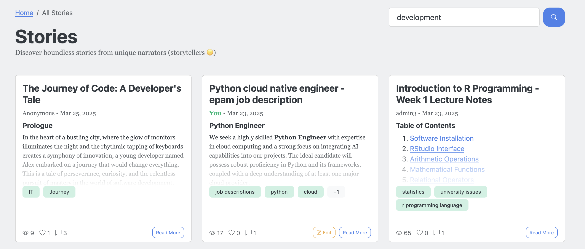
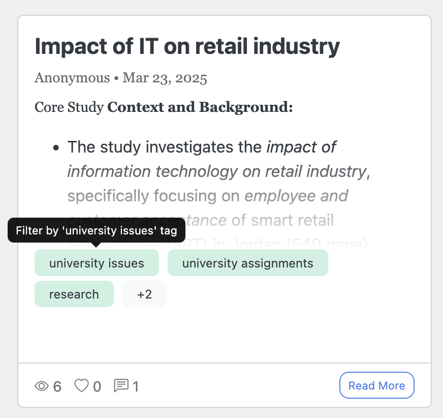
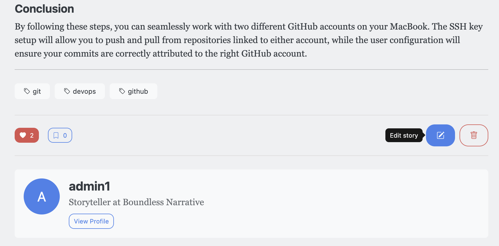
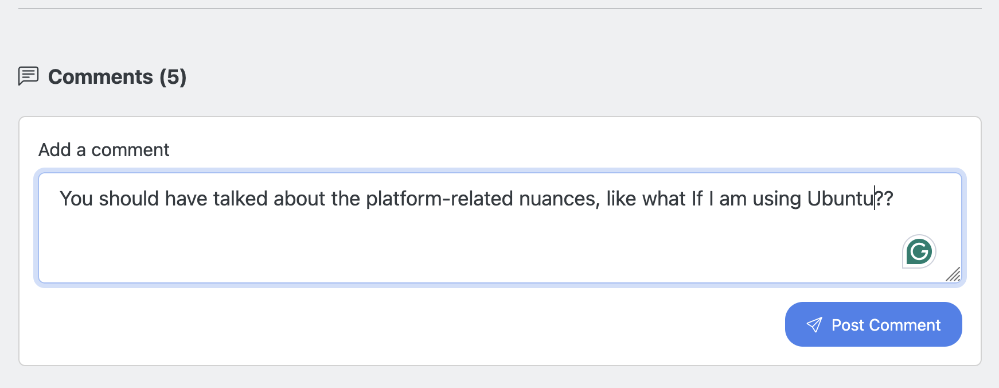

# 🌠 Boundless Narrative ✨


> *"Stories are light. Light is precious in a world so dark."* – Kate DiCamillo

## 🌌 Welcome to the Infinite Story Space

Here, stories transcend identity, and narratives know no bounds.

<details>
<summary>✨ Click to learn more about our vision</summary>
<br>
We believe that storytelling is the most powerful form of human expression. Boundless Narrative was created to provide a space where anyone can share their voice without fear or limitation.
</details>

## 💫 What is Boundless Narrative?

Here, you can share your stories, tell your tales, and explore the boundless world of narrative. You can remain anonymous if you wish. You can like ❤️ and bookmark 🔖 the posts of others, and leave comments 💬 to express your thoughts and feelings.

<!-- PROJECT FEATURES TABLE -->
| Feature | Description | Icon |
|---------|-------------|------|
| Story Creation | Share your own stories with the world | 📝 |
| Anonymous Posting | Stay hidden while people read yout story  | 🌙 |
| Interaction | Like, bookmark, and comment on stories | ❤️ |
| Discover | Find stories that resonate with you | 🔍 |

## 🔗 References

- 🌐 Links to the deployed page: 
- [boundlessnarrative.com](https://boundlessnarrative.com)
- [www.boundlessnarrative.com](https://www.boundlessnarrative.com)
- [Public Domain of EC2 Instance](http://3.89.104.190/) 
- [AWS Load Balancer URL](https://boundless-narrative-lb-2051809694.us-east-1.elb.amazonaws.com/) 
- 📂 Link to the GitHub repository: [github.com/00017501/bn](https://github.com/00017501/bn)

## 🚀 How to Run the Project

### 1️⃣ Clone the repository
```shell
# through ssh 🔐
git clone git@github.com:00017501/bn.git

# through https 🔒
git clone https://github.com/00017501/bn.git
```

### 2️⃣ Go into the project root directory
```shell
cd bn/
```

### 3️⃣ Make sure to have Node.js installed
- 📥 See [Official Node.js website](https://nodejs.org/en/download)

### 4️⃣ Install the dependencies
```shell
npm install
```

### 5️⃣ Run the project for local development
```shell
npm run dev
```

<div align="center">
  
  
  
</div>

## 🤖 Project Dependencies

<details open>
<summary><b>🏗️ Core Framework & Server</b></summary>
<br>

- [express](https://expressjs.com/) - 🚂 Web framework for Node.js that the project used
- [express-session](https://www.npmjs.com/package/express-session) - 🔑 Implement the session/cookie based authentication
- [express-validator](https://express-validator.github.io/docs/) - ✅ Validate and sanitize user input in the server side

</details>

<details>
<summary><b>🔒 Authentication & Security</b></summary>
<br>

- [bcrypt](https://www.npmjs.com/package/bcrypt) - 🔐 Password hashing with secure salts

</details>

<details>
<summary><b>📝 Content Processing</b></summary>
<br>

- [marked](https://www.npmjs.com/package/marked) - ✍️ Parses the markdown to HTML
- [DOMPurify](https://www.npmjs.com/package/dompurify) - 𝌞 Cleans the html and helps to render the html elements

</details>

<details>
<summary><b>🎨 Templating</b></summary>
<br>

- [ejs](https://www.npmjs.com/package/ejs) - 🖌️ Embedded JavaScript templates for dynamic HTML
- [express-ejs-layouts](https://github.com/expressjs/express-ejs-layouts) - 📐 Layouts support for EJS in Express

</details>

<details>
<summary><b>🛠️ Development Tools</b></summary>
<br>

- [nodemon](https://www.npmjs.com/package/nodemon) - 🔄 Server runner that can auto-restart in case of changes during development

</details>

<details>
<summary><b>🧹 Code Quality</b></summary>
<br>

- [eslint](https://www.npmjs.com/package/eslint) - 🔍 Code linting for clean, consistent JavaScript

</details>

## ✨ Features

<div align="center">
  <table>
    <tr>
      <td align="center"><h3>📝</h3>[Create](#anonymous-posting)</td>
      <td align="center"><h3>🔍</h3>[Discover](#discovering-new-stories)</td>
      <td align="center"><h3>❤️</h3>[Like](#story-actions)</td>
    </tr>
    <tr>
      <td align="center">Share your unique stories</td>
      <td align="center">Find narratives that inspire</td>
      <td align="center">Show appreciation</td>
    </tr>
    <tr>
      <td align="center"><h3>🔖</h3>[Bookmark](#story-actions)</td>
      <td align="center"><h3>💬</h3>[Comment](#story-actions)</td>
      <td align="center"><h3>😶‍🌫️</h3>[Anonymous](#anonymous-posting)</td>
    </tr>
    <tr>
      <td align="center">Save for later reading</td>
      <td align="center">Engage in discussion</td>
      <td align="center">Post without revealing your identity</td>
    </tr>
  </table>
</div>

## 📊 Project Structure
```
boundlessnarrative/
├── 📁 public/            # Static assets
│   ├── 📁 css/           # Stylesheets
│   ├── 📁 js/            # Client-side JavaScript
│   └── 📁 images/        # Images and icons
├── 📁 views/             # EJS templates
│   ├── 📁 layouts/       # Layout templates
│   ├── 📁 partials/      # Reusable components
│   └── 📁 pages/         # Page templates
├── 📁 controllers/       # Request handlers
├── 📁 services/          # Business logic entities
├── 📁 middleware/        # Express middleware
├── 📁 validators/        # Express server-side validators
├── 📁 routes/            # Application routes (endpoints)
├── 📁 data/              # Folder with data collections
├── 📄 app.js             # Main entry point
└── 📄 package.json       # Project configuration
```

## Features illustrated

###  Anonymous posting
You can make your stories anonymoys


### Discovering new stories
You can search and filter to find stories you are interesting in



You can filter stories by tags to find stories with similar tags



### Story actions

You can like and bookmark stories. And if you are an author of the story, you can also edit and delete them



### Commenting stories

You can leave comments under stories

