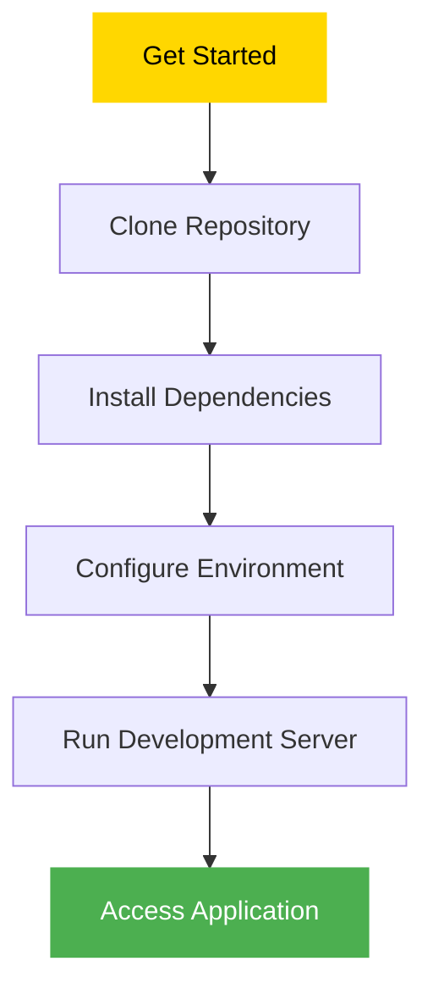

# 🌠 Boundless Narrative ✨


> *"Stories are light. Light is precious in a world so dark."* – Kate DiCamillo

## 🌌 Welcome to the Infinite Story Space

In a digital realm where every voice deserves to be heard, Boundless Narrative emerges as a sanctuary for storytellers, dreamers, and truth-seekers. Here, stories transcend identity, and narratives know no bounds.

<details>
<summary>✨ Click to learn more about our vision</summary>
<br>
We believe that storytelling is the most powerful form of human expression. Through stories, we connect, we heal, we understand, and we grow. Boundless Narrative was created to provide a space where anyone can share their voice without fear or limitation.
</details>

## 💫 What is Boundless Narrative?

Here, you can share your stories, tell your tales, and explore the boundless world of narrative. You can remain anonymous if you wish. You can like ❤️ and bookmark 🔖 the posts of others, and leave comments 💬 to express your thoughts and feelings.

<!-- PROJECT FEATURES TABLE -->
| Feature | Description | Icon |
|---------|-------------|------|
| Story Creation | Share your own narrative with the world | 📝 |
| Anonymous Posting | Stay hidden while your story shines | 🌙 |
| Interaction | Like, bookmark, and comment on stories | ❤️ |
| Discover | Find stories that resonate with you | 🔍 |
| User Profiles | Create your author persona | 👤 |

## 🔗 References

- 🌐 Link to the deployed page: 
- [server public domain](http://3.89.104.190/) 
- [load balancer https url](https://boundless-narrative-lb-2051809694.us-east-1.elb.amazonaws.com/) 
- [boundlessnarrative.com](https://boundlessnarrative.com)
- [www.boundlessnarrative.com](https://www.boundlessnarrative.com)
- 📂 Link to the GitHub repository: [github.com/00017501/bn](https://github.com/00017501/bn)

## 🚀 How to Run the Project

<div align="center">



</div>

### 1️⃣ Clone the repository
```shell
# through ssh 🔐
git clone git@github.com:00017501/bn.git

# through https 🔒
git clone https://github.com/00017501/bn.git
```

### 2️⃣ Go into the project root directory
```shell
cd bn/
```

### 3️⃣ Make sure to have Node.js installed
- 📥 See [Official Node.js website](https://nodejs.org/en/download)

### 4️⃣ Install the dependencies
```shell
npm install
```

### 5️⃣ Run the project for local development
```shell
npm run dev
```

<div align="center">
  
  
  
</div>

## 🤖 Project Dependencies

<details open>
<summary><b>🏗️ Core Framework & Server</b></summary>
<br>

- [express](https://expressjs.com/) - 🚂 Fast and minimalist web framework for Node.js
- [express-session](https://www.npmjs.com/package/express-session) - 🔑 Session middleware for managing user state
- [express-validator](https://express-validator.github.io/docs/) - ✅ Validate and sanitize user input

</details>

<details>
<summary><b>🔒 Authentication & Security</b></summary>
<br>

- [bcrypt](https://www.npmjs.com/package/bcrypt) - 🔐 Password hashing with secure salts

</details>

<details>
<summary><b>📝 Content Processing</b></summary>
<br>

- [marked](https://www.npmjs.com/package/marked) - ✍️ Markdown parser and compiler for rich content

</details>

<details>
<summary><b>🎨 Templating</b></summary>
<br>

- [ejs](https://www.npmjs.com/package/ejs) - 🖌️ Embedded JavaScript templates for dynamic HTML
- [express-ejs-layouts](https://github.com/expressjs/express-ejs-layouts) - 📐 Layout support for EJS in Express

</details>

<details>
<summary><b>🛠️ Development Tools</b></summary>
<br>

- [nodemon](https://www.npmjs.com/package/nodemon) - 🔄 Auto-restart server during development

</details>

<details>
<summary><b>🧹 Code Quality (Dev Dependencies)</b></summary>
<br>

- [eslint](https://www.npmjs.com/package/eslint) - 🔍 Code linting for clean, consistent JavaScript

</details>

## ✨ Features

<div align="center">
  <table>
    <tr>
      <td align="center"><h3>📝</h3>Create</td>
      <td align="center"><h3>🔍</h3>Discover</td>
      <td align="center"><h3>❤️</h3>Like</td>
    </tr>
    <tr>
      <td align="center">Share your unique stories</td>
      <td align="center">Find narratives that inspire</td>
      <td align="center">Show appreciation</td>
    </tr>
    <tr>
      <td align="center"><h3>🔖</h3>Bookmark</td>
      <td align="center"><h3>💬</h3>Comment</td>
      <td align="center"><h3>🌙</h3>Anonymous</td>
    </tr>
    <tr>
      <td align="center">Save for later reading</td>
      <td align="center">Engage in discussion</td>
      <td align="center">Post without revealing identity</td>
    </tr>
  </table>
</div>

## 📊 Project Structure
```
boundlessnarrative/
├── 📁 public/            # Static assets
│   ├── 📁 css/           # Stylesheets
│   ├── 📁 js/            # Client-side JavaScript
│   └── 📁 images/        # Images and icons
├── 📁 views/             # EJS templates
│   ├── 📁 layouts/       # Layout templates
│   ├── 📁 partials/      # Reusable components
│   └── 📁 pages/         # Page templates
├── 📁 controllers/       # Request handlers
├── 📁 services/          # Business logic
├── 📁 middleware/        # Express middleware
├── 📁 validators/        # Express validators
├── 📁 routes/            # Application routes
├── 📁 data/              # Folder with data collections
├── 📄 app.js             # Application entry point
└── 📄 package.json       # Project configuration
```

## 💖 Happy storytelling!

<div align="center">

***May your narratives know no bounds!*** 🚀✨

[](https://github.com/00017501/bn)

</div>